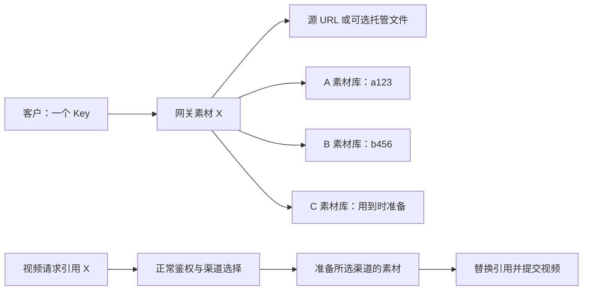

# Seedance 统一素材管理设计

日期：2026-09-28。状态：暂定，不代表当前项目已提供以下能力。

需求参照：https://github.com/QuantumNous/new-api/issues/7260 。只覆盖普通图片、视频素材，真人认证暂不纳入同步。

## 1. 客户侧目标

客户使用一个网关 Key，登记或上传一次素材，获得一个稳定的网关素材 ID。创建视频时继续使用该 ID；网关负责为实际视频渠道准备对应素材，并替换上游请求中的引用。

客户能列出自己登记的统一素材，不需要知道渠道、供应商 ID、同步任务或各上游凭据。同一网关用户的多个 Token 共享素材归属；不同用户保持隔离。

URL 直传只是个别供应商适配器可采用的内部能力，不替代统一素材管理目标。客户仍可使用统一 ID、查询列表和删除素材。

## 2. 三类核心记录

| 记录 | 主要内容 | 作用 |
|---|---|---|
| 统一素材 | 公共 ID、user_id、类型、名称、逻辑分组、源地址/可选对象存储位置、版本、删除标记 | 客户认识的唯一素材 |
| 上游副本 | 素材 ID、素材库身份、项目、版本、供应商素材 ID/任务 ID、状态、过期时间、最近查询时间 | 同一素材在各供应商的实际资源 |
| 持久任务 | 准备/查询/删除操作、请求标识、阶段、下次执行时间、重试次数、执行权版本、脱敏错误 | 进程重启后继续工作，避免重复创建 |

副本按“素材 + 版本 + 素材库身份”唯一。素材库身份表示具体上游账号/项目和后端，不能仅根据域名判断同库；多个视频渠道只有明确共用同一素材库时才复用副本。项目和上游账号切换必须形成新的目标身份，同账号换密钥可以保留身份。

新数据使用专用 GORM 模型和可查询字段，不把全部状态塞进旧 ConfigurableResourceState.Metadata。扩展数据使用 TEXT 和 common JSON 包装函数，迁移兼容 SQLite、MySQL >= 5.7.8、PostgreSQL >= 9.6。

旧 ID 的兼容别名、逻辑分组与上游组映射可以增加辅助记录。不得把多个同名供应商 ID 直接作为全局唯一资源；已登记归属、撤销记录及用户范围始终参与解析。

## 3. 原文件保存方式

默认允许客户提供可访问的源 URL。数据库保存源地址和必要元数据；不要求网关额外托管一份文件。

可选托管到已有 OSS/R2 等对象存储。项目已有上传代码可复用，但需要保存可重新生成访问地址的对象位置，不能只存一次性的签名 URL。大文件不进入数据库。

源地址应在后续同步期间保持可用且内容稳定。同一统一素材代表固定内容，替换内容创建新素材；已经得到内容摘要时，后续同步发现源内容变化应停止，避免不同供应商拥有不同内容。无法长期保证外部 URL 不变的场景可选择托管。

源失效不立即作废仍可用的上游副本；向新渠道同步或重建过期副本需要重新提供相同内容的可访问来源。来源获取执行已有网络访问约束和文件大小限制，不把客户 URL 当作无限制的服务端下载入口。

## 4. 创建与按需同步

创建统一素材时，用一个本地事务保存素材及准备任务。源文件无需经过所有供应商后才响应。响应携带统一 ID，处理过程可查询。

推荐初始只准备一个按当前策略选出的主要素材目标；其他渠道首次使用时再准备。这样兼容客户等待素材 Active 后再提交视频的习惯，也避免上传后立即复制到全部渠道。管理员可以显式配置少量常用备用目标预先准备，不能自动把素材扩散到全部渠道。

后台准备流程：

1. 检查目标能力、账号/项目、素材归属、源状态和现有副本。
2. 已有同版本可用副本则直接复用；已有创建/处理任务则加入等待，不重复上传。
3. 需要素材 ID 的目标调用其创建接口，保存供应商 ID 或上传任务 ID，再按协议查询处理状态。
4. 目标明确支持普通 URL 引用时，适配器可以返回 URL 引用准备结果，无需伪造供应商素材 ID。
5. 确认可用后唤醒等待该副本的视频请求。

创建接口返回 ID 不等于素材可用。供应商异步处理、审核失败、过期、外部删除分别记录；只把确认可用且未过期的副本用于视频请求。

## 5. 视频任务要自动跨过素材准备阶段

只过滤已有副本会导致新渠道永远不会被准备，因此必须同时支持“复用现有副本”和“为实际选中渠道补齐副本”。

处理顺序：

1. 沿用网关认证、模型/协议限制、显式渠道和路由策略，解析全部素材归属；素材映射不能扩大候选渠道权限。
2. 在原有排序规则允许的范围内复用已准备好的渠道；需要使用尚未拥有素材的目标时，登记该目标的准备任务。
3. 一次视频使用多个素材时，必须在同一个视频目标准备全部素材，不能把 A 的图片 ID 和 B 的视频 ID 拼进一次请求。
4. 副本全部可用时直接提交视频；需要异步准备时，返回一个稳定的网关视频任务 ID，状态为 queued。后台自动完成准备再提交，客户继续查询同一个任务。
5. 真正提交前重新验证用户/Token 状态、权限、目标账号配置及素材是否已删除，并进入现有定价、预扣和提交流程。实际渠道和计费上下文一致；素材准备本身不能伪装为已发生的视频消费。
6. 在供应商可能已接受视频请求后，保留现有禁止盲目重放规则。素材同步不赋予视频创建无限切换渠道重试的能力。

准备阶段应有可配置的总期限；超过期限或源不可恢复时，将同一网关任务标为失败，并返回客户可理解的原因。不得让 HTTP 请求无限等待，不要求客户自己在各供应商之间补传素材。

当前视频轮询和超时退款以已提交的上游任务为基础。应为待准备的视频提交意图建立独立的持久状态和请求快照，查询接口合并展示 queued 状态；供应商任务确定后再接入现有轮询结算，保留同一公共 task_id。准备阶段的记录不能被普通任务轮询误发到上游，不能被现有超时退款当成已经扣费的视频任务。

客户端提供幂等标识时，同一用户、同一标识和相同请求复用公共任务 ID；标识相同但参数不同拒绝。没有幂等标识的两个合法视频请求不能仅因内容相同就自动合并。

## 6. 状态与统一列表

内部区分源状态、各副本状态和视频提交状态，避免某个供应商失败就把整份素材判为永久失败。

副本状态至少包括：待准备、创建结果待确认、上游处理中、可用、明确失败、已过期、待删除、已删除。创建结果不明与明确失败必须区分。

客户统一素材状态采用可解释的汇总：初始化且没有可用副本时为 Processing；至少一个可用副本时可为 Active；没有可用副本且本次准备已明确不可恢复时为 Failed。URL 直传目标只有在符合目标输入契约及来源可用性要求时才可算作准备完成。Active 不承诺任意模型、Token 或停用渠道都可使用。

统一列表查询本地素材主记录，每份素材只出现一次，不临时串行遍历所有供应商。后台查询副本状态和已知过期时间，详情读取陈旧状态时可触发刷新。未知过期时间不能编造永久有效或精确到期时间。

统一列表使用独立版本的游标，绑定用户、逻辑项目、筛选和排序；使用稳定排序键，分页不再随本次视频渠道变化。旧列表游标不套用到新集合。

## 7. 分组、修改和删除

客户分组是网关逻辑分组，各上游需要时创建用户隔离的对应组。不能因为供应商返回默认父组就取得该组全部素材的权限。

名称和描述由统一记录管理，并在目标支持时更新副本；内容替换创建新素材。不同后端缺少更新能力时，不影响统一名称的展示，也不能声称已经更新了不支持该操作的上游。

删除先登记持久删除意图并禁止新引用，再按具体副本异步清理。迟到的创建成功响应必须转入清理，不能把已删除素材恢复为可用。对已接受的视频任务保留必要引用，物理清理等待这些任务结束或按明确的生命周期规则处理。

逻辑分组删除按已登记、属于当前用户的副本清理，不盲目调用供应商共享父组的级联删除。上游不支持删除时，客户逻辑删除仍生效，但管理员须能看到远端未清理状态，不能显示远端已删除。

源文件的删除只针对网关托管且没有剩余引用的对象。不会删除客户提供的外部 URL 对应文件。

## 8. 并发、故障和恢复

数据库唯一键及短事务控制同一副本的创建意图，HTTP 不在数据库事务内执行。已有任务框架可以负责定时扫描/唤醒，但它按任务类型只保留一个活动任务，不能直接用每次 EnqueueSystemTask 代替每份素材的独立任务记录。

调用上游前保存操作标识和阶段。供应商支持幂等键时使用稳定幂等键；支持按请求标识查找时用于恢复。EOF、超时、进程崩溃后的结果不明请求先查询核对；不能因为工作锁过期就认为供应商未创建并再上传一次。无法核对的记录保留待确认状态，供管理员处理。

执行权版本只防止过期 worker 覆盖本地状态，不代表可以保证远端只执行一次。不得宣称所有供应商均能做到 exactly-once。

明确未创建的可恢复错误按目标限速和退避处理；能力不支持、源过期或权限错误不能无限重试。删除与上传、认领、视频引用通过同一套素材版本和删除状态协调。

## 9. 接口与现有代码兼容

官方 Action 入口继续使用 ResponseMetadata / Result 和现有字段形式；新素材的 Id 是网关公共 ID，不宣称它就是火山原始 ID。供应商副本 ID、渠道编号、凭据和诊断只在管理员接口出现。#7260 提议的 providers 明细接口应限管理员使用。

新统一素材 ID 使用明确独立的命名空间。找不到这种 ID 时直接返回不存在，不能进入历史上游素材首次认领分支。

旧素材继续通过现有归属和原渠道处理；具备可靠来源且归属无歧义时，可补录为一个统一素材及首个副本，保留旧 ID 的用户范围别名。只有旧 ID、没有来源的记录继续在原渠道使用，不能假装可迁移到所有供应商。不同用户、不同上游的同名 ID 不自动合并。

新模式按用户或部署配置启用，新建接口按模式创建资源；已有 ID 的处理方式依据该 ID 的记录类型决定。停用新建/自动同步不应导致已经发给客户的统一 ID 立即失效。新旧列表通过明确模式区分，不把现有列表偷偷变成全渠道集合。

主要接入位置：

- controller/asset_access.go、asset_legacy_access.go：统一 ID/旧 ID 分流与归属校验。
- controller/asset_list.go：统一目录的列表实现与独立游标；旧路径保留。
- controller/asset_video_access.go：为统一素材解析目标副本；旧素材继续使用原渠道约束。
- controller/relay.go、relay/relay_task.go：素材准备阶段、统一任务查询及实际提交衔接。
- relay/channel/configurable：复用协议适配与签名，按目标能力生成实际引用；不把所有协议的项目字段或 Tgx 别名规则混用。
- 新增 model/service 素材与同步模块：承载持久状态，避免将业务全塞入 controller。

## 10. 实施验收

第一批打通两个实际供应商：统一创建和列表、一个主目标准备、第二目标按需准备、同一公共 ID 引用、后台自动衔接视频及删除。只有流程闭环后才能称为跨渠道素材同步。

必要测试包括：同用户换 Token、跨用户拒绝、已有副本复用、多素材取同一目标、无兼容渠道、旧 ID 和普通无素材视频兼容、源过期、账号切换、创建超时结果不明、并发准备、处理中删除、重启续跑、准备等待与视频计费隔离、供应商删除不支持。数据库并发行为覆盖三种数据库；真实供应商验证需确认入库后的素材引用视频确实成功。

本次仅确定设计，不改动现有业务实现、部署或已有数据，也不把公开议题里的开发进度当作可直接使用的完成品。
