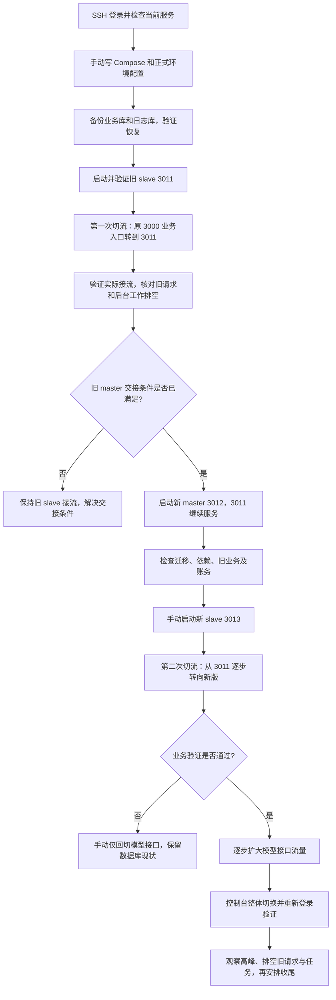

# APIMeter 升级计划说明

日期：2026-09-13。目标服务器：`159.195.18.62`。新部署目录：`/opt/apimeter-server`。

当天实际执行过程、异常处理与待确认事项见[生产升级过程复盘](apimeter-upgrade-review-2026-09-13.md)。本文保留发布前计划视角，不能替代最终线上状态记录。

手动操作从[第 12 节](#12-手动-shell-操作顺序)开始：每一步直接复制 Shell 命令，查看结果后再进入下一步。

本文依据此前服务器只读检查、目录整理和隔离升级测试编写，是待执行的升级方案。手动操作步骤和配置模板已写入本地，没有执行线上迁移、启动容器或修改 Caddy。

本次采用“启动并验证旧 slave 3011 → 将原 3000 的业务入口切至 3011 → 排空旧请求并完成旧 master 交接 → 启动新 master 3012 迁移数据库 → 模型接口逐步切至新版 → 控制台整体切换”的顺序。目标是模型接口持续可用、已有请求尽量自然结束；控制台切换按用户需要重新登录设计。严格零错误仍需通过真实 Caddy 切流、实际业务负载和后台任务交接验证。

## 1. 当前状态与版本基线

| 项目 | 已知状态 | 对升级的影响 |
| --- | --- | --- |
| 现有 3000 服务 | 宿主机 `new-api` 进程，工作目录 `/www/wwwroot/modelsell`；检查时程序路径位于 `releases/20260730101615-aa0590ffa/` | 它不使用 `/opt/apimeter-server`，但不能据目录名认定它等同于已测旧镜像 |
| 现有 MySQL | 宿主机 3306，数据目录 `/www/server/data` | 保留实例和数据目录；应用升级所需的 DDL 与数据回填属于正式发布操作 |
| 现有 Redis | 宿主机 `127.0.0.1:6379` | 保留实例、数据和连接配置，不清空缓存 |
| Caddy | v2.11.4，宿主机 systemd 服务；此前运行配置与 `/etc/caddy/Caddyfile` 一致 | 支持热加载，但热加载本身不能证明业务完全无感 |
| 正式站点 | `alex.apimeter.ai`、`alex.apimeter.net`、`www.apimeter.net`：文档请求到 3030，其余到 3000 | 当前只有一个业务上游，尚未配置新旧节点切流 |
| 测试站点 | `test.apimeter.net` 到 3100 | 已有服务占用，不作为本次新容器端口或随意覆盖的测试入口 |
| 新部署目录 | `/opt/apimeter-server` 只剩 `README.md` | 可以放新的 Compose、环境变量和独立数据目录 |

已经完成归档：

- 重要资料：`/opt/apimeter-server-preserved/20260913-125058/`，约 691 MB，包含原 SQL 备份、`.env`、`compose.yml`、`data/`、测试证据和迁移校验记录。
- 测试资料：`/opt/apimeter-server-test-archive/20260913-125058/`，约 4.9 GB，包含 `test57/`、`compat-20260913/`、`test-mysql8-data/` 和临时配置，已标记仅测试用途。
- 归档通过文件迁移校验，整理前后现有服务和容器运行状态一致。归档位于同一台服务器，不替代发布前的新备份或异机备份。
- 保留的停止测试容器仍引用原挂载路径，不能直接重新启动；复测应在新的隔离目录调整路径并重建。

本次已测试的镜像固定为：

| 用途 | 镜像 | 固定摘要 |
| --- | --- | --- |
| 旧 slave | `wagjie/modelsell-api:modelsell-2026.08.05` | `sha256:f45ab9f8be563e6f08d72a0301bd9300ca69a6aea7135338285f516a20bc3f44` |
| 新 master | `apimeter/apimeter:v1.0.2` | `sha256:bd4c728b7c614f4f181ad86e8d90d12043eb0e3e6383af06fcd1a5a206de2ede` |

新版对应提交 `6b56551d67d2151e2e5d65d1c1e9afb08259e92e`。正式 Compose 应固定摘要；如果更换目标镜像，应重新评估迁移和兼容性，不能沿用本次结论直接放行。

## 2. 已经验证和仍需补足的内容

在独立 MySQL 5.7.43、独立 Redis、备份数据和模拟上游下，已验证：

- 连续请求 1,251 次，全部成功；743 次模型调用对应 743 条消费日志，扣费合计 7,430，用户和令牌余额核对一致。
- 一条 90 秒 SSE 跨越新 master 启动与迁移，正常结束。
- 新 master 停止后，旧 slave 仍可处理已测请求；旧 slave 在迁移后数据库上重新启动也通过验证。
- 迁移后新旧版互查图片任务、旧版创建用户后新版登录均通过。
- 该备份的业务库新增 6 张表，5 张既有表变化，未删表或删旧字段；日志库表结构没有变化。

明确存在的限制：

| 项目 | 事实 | 发布策略 |
| --- | --- | --- |
| 控制台会话 | 旧 Cookie 访问新版返回 401 | 控制台整体切换，按重新登录设计；不能声称无感登录迁移 |
| 会话撤销 | 新版退出后，同一凭据在新版返回 401、旧版返回 200 | 切换后不能让控制台鉴权请求回落到旧版；普通粘性会话不足以修复这一问题 |
| 线上旧程序 | 尚未证明 3000 进程与已测旧镜像完全相同 | 核对真实版本与角色，必要时使用实际旧程序补测 |
| 后台任务 | 只验证了旧 slave 与新 master，没有验证线上旧 master 与新 master 的完整混跑 | 必须明确迁移执行者和后台任务负责人，不能默认双 master 安全 |
| 在线迁移 | 已测有限并发，没有生产峰值和连续元数据锁采样 | 低峰实施，监控 DDL 锁等待和旧节点请求延迟 |
| 长任务 | 未验证图片任务执行中停进程、后台接管与最终批量写入 | 切流后等待请求和任务结束，再评估停旧节点 |
| Caddy | 尚未实际通过 Caddy 切流测试 | 正式切流前补做 SSE、WebSocket 和回切演练 |

新 master 在一次测试中约 2.196 秒就绪，该数字包含启动、迁移和探测，不能作为生产迁移时长承诺。结构未变的表也可能有数据回填，不能把升级理解为只执行几个 `ALTER TABLE`。

## 3. 部署结构与文件准备

建议预留以下节点，端口在实施前重新检查：

| 节点 | 宿主端口建议 | 角色 | 用途 |
| --- | --- | --- | --- |
| 现有旧服务 | 3000 | 待核对 | 保持现状，作为当前入口和可能的回切目标 |
| 旧版过渡节点 | 3011 | `slave` | 本流程的过渡接流节点，镜像须与实际旧业务兼容 |
| 新版主节点 | 3012 | `master` | 负责迁移和新版业务，迁移完成前不接正式入口流量 |
| 新版从节点 | 3013 | `slave` | 迁移完成后再启动，用于新版冗余和后续滚动升级 |

`slave` 是应用角色，不是只读数据库节点。它仍会处理请求、扣费和写日志，只是跳过主节点数据库迁移等工作。不能把新 slave 直接部署到尚未升级的数据库上，并指望它自动补齐新表。

预期目录如下；已提供本地模板，正式连接信息和现场 Caddy 候选配置仍需填写：

```text
/opt/apimeter-server/
  README.md
  compose.yml
  env/
    shared.env
  data/
    old-slave/
    new-master/
    new-slave/
  caddy/
    before-upgrade.Caddyfile
    candidate.Caddyfile
    rollback-api.Caddyfile
  release/
    images.txt
    baseline.json
    checks.md
```

Compose 只管理本次应用节点，使用独立项目名，例如 `apimeter-upgrade`。不把现有 MySQL、Redis、Caddy 纳入这个项目，也不复用旧测试容器名称和数据目录。禁止把仓库中自带 MySQL/Redis 的整套生产 Compose 原样套到当前服务器。

配置核对要求：

1. 新旧节点连接同一套正式业务库、日志库和 Redis；分别核对 `SQL_DSN`、`LOG_SQL_DSN`，避免漏掉独立日志库。
2. 保持 `SESSION_SECRET`、`CRYPTO_SECRET` 与正式业务一致，节点使用不同的 `NODE_NAME`。相同密钥不能消除已经证实的会话格式差异。
3. 明确写入 `NODE_TYPE` 和 `PORT`，原归档 `.env` 是 `slave / 3011` 配置，仅供参考，不能当作新 master 配置直接恢复。
4. 为每个节点设置连接池和内存上限，按节点总数计算 MySQL 连接预算，不能给每个新增节点沿用过大的默认连接池。
5. 明确容器网络方案。现有 Redis 只监听宿主回环地址，普通 bridge 容器中的 `127.0.0.1` 不能访问它。若采用 host 网络，当前程序会在所选端口全地址监听，应先落实仅本机或受控来源可达的端口限制；不要为解决容器连接而把 Redis 暴露到公网。
6. 临时图片采用本地存储：宿主机 `/opt/apimeter-server/data/shared/relay-temp-images` 挂载到各节点 `/data/relay-temp-images`，仅共享图片子目录；每个节点的其他 `/data` 内容仍独立。需验证跨节点下载、正式域名图片路由和切流后的旧链接，操作见 [本地图片存储说明](apimeter-upgrade/local-image-storage.md)。
7. 新版可先采用 `SHUTDOWN_TIMEOUT_SECONDS=900`、Compose `stop_grace_period: 16m` 作为排空预算，再按真实最长请求调整。此配置不能证明旧版支持同一行为，也不保证后台任务和批量账务自动完成。

## 4. 正式升级前必须解决的主节点交接

当前约束是保留 3000 服务，不调整现有 Redis/MySQL 实例。新 master 连接正式库启动就会执行 DDL 和回填，启动后还会运行后台任务；即使 Caddy 尚未切流，也已经影响共享业务状态。

首先只读核对 3000 进程的实际版本、有效 `NODE_TYPE`、启动配置、任务开关以及是否存在其他主节点。当前代码在 `NODE_TYPE` 不等于 `slave` 时按 master 运行，不能因环境里没有写 `master` 就认为它是从节点。

| 核对结果 | 处理方式 |
| --- | --- |
| 旧业务节点均为 slave，且后台任务负责人已明确 | 可按后续步骤启用唯一的新 master，核对任务恢复和业务持续性 |
| 3000 或其他旧节点为 master，但所有重叠任务已证明跨版本互斥且可安全混跑 | 可设计短暂重叠窗口，记录具体证据和退出顺序；本次隔离测试尚不提供这项证明 |
| 存在旧 master，任务互斥或接管尚不明确 | 先完成隔离补测或交接方案，不直接启动连接正式库的新 master |

本流程先让旧 slave 3011 接流，再确认原节点上的存量请求、批量写入和后台工作状态，最后进行旧 master 交接。切流本身不会停止 3000，也不会终止它的定时任务或接管已经运行的异步任务。

若交接需要停用或改变 3000 上旧 master 的角色，这会超出当前不动 3000 的范围，不能作为本计划的默认执行动作。若该限制持续保留，则先实现并验证可在该限制下工作的迁移与后台任务控制方案；交接条件尚未满足时，停在旧 slave 已接流的阶段，不启动新 master。已完成的旧 slave / 新 master 测试不构成旧 master / 新 master 同时运行安全的证据。

这一步决定生产升级是否可执行。不能用“Caddy 能切流”替代主节点交接，也不能假设程序已有“只迁移后退出”的发布模式。

## 5. 分阶段实施

以下步骤是正式实施时的操作顺序，各阶段满足退出条件后再继续。

| 阶段 | 操作 | 退出条件 | 预计安排 |
| --- | --- | --- | --- |
| A：发布准备 | 核对线上版本/角色、端口、任务交接、路由清单；生成固定摘要的 Compose 和私有 env 文件；只做配置校验和镜像预拉取 | 版本对应、角色交接和连接目标明确，配置不包含现有数据库服务 | 提前完成，约 30–60 分钟起 |
| B：新备份与恢复检查 | 备份正式业务库和日志库、Caddy 配置、实际运行环境和本地业务文件；记录恢复点 | 备份完整，隔离恢复可用，知道如何保留升级后的新增数据 | 时间按实际库规模和备份工具确定 |
| C1：旧 slave 验证 | 启动 3011，在独立入口验证旧 Cookie、调用、账务、任务和长连接 | 旧镜像与当前业务兼容，旧节点切流候选及回切路径有效 | 约 20–30 分钟起 |
| C2：第一次切流 | 将原 3000 的业务入口切至 3011，保持文档和其他站点路由 | 正式请求确实到达 3011，登录及模型调用正常，已有流未被截断 | 独立观察窗口 |
| C3：排空与交接 | 核对 3000 存量请求、绕行直连、批量写入及后台工作，完成已明确范围内的旧 master 交接 | 旧 master 已不再执行需要移交的工作，或已证明重叠执行安全 | 按实际连接和任务状态确定 |
| D：迁移 | 仅在交接完成后启动新 master；正式入口继续交给旧 slave 3011 | 迁移成功，新版依赖就绪，旧 slave 请求、扣费及日志无异常 | 按现场监控，不按实测 2.196 秒倒计时 |
| E：接口切流 | 新 master 直连验收；迁移后启动同版本新 slave；模型接口逐步切向新版 | 各批次达到验证标准，普通调用、SSE 和任务查询通过 | 建议每批至少 10–15 分钟 |
| F：控制台切换 | 控制台及其鉴权相关入口整体指向新版，完成重新登录验收 | 登录/退出/权限/日志/令牌操作符合新版语义，控制台没有旧版回落入口 | 单独安排观察窗口 |
| G：观察与收尾 | 保留回切材料，观察账务、后台任务和业务高峰；随后评估旧节点退出 | 长连接、任务、最终写入均已核对，回切窗口明确关闭 | 至少覆盖一个业务高峰；可按 24 小时安排 |

这些时间是执行安排建议，不代表已测停机时长或完成承诺；主节点交接、版本不符和存储问题可能需要额外开发与复测。

备份应使用适合现有 MySQL 的一致性方案。两个库在持续写入时分别导出，不自动构成同一业务时刻的备份；应记录可用的 binlog/恢复点，并验证跨库恢复。现有归档 SQL 是测试基线，不能替代发布前新备份。

DDL 可能等待元数据锁，MySQL DDL 也不能视为一个可整体回滚的事务。迁移期间持续观察旧节点错误率、延迟、数据库连接和锁等待；失败后先记录已经完成的结构及回填，再决定恢复或修复，避免容器无限重启反复执行迁移。

## 6. Caddy 切流设计

保留现有正式域名、证书、文档到 3030 的路由及 `test.apimeter.net` 到 3100 的路由。根据现场完整配置生成候选文件，先 `caddy validate`，再通过 `caddy reload` 应用；切换后核对运行配置与磁盘配置一致。

不要直接执行现有 `scripts/deploy-modelsell.sh` 完成本次 Compose 切换。该脚本面向 systemd/二进制发布，依赖 `primary_proxy`、`distributed_proxy` 等片段，而现场 Caddy 配置没有这些片段；其 standby-first 顺序也不能替代本次 master 先完成新数据库结构的安排。

**第一次切流发生在新 master 启动前：将原来送往 3000 的业务请求送往旧 slave 3011。** 旧 slave 的登录会话、API 调用和文件/任务兼容性验证通过后，才可以让它完整承接旧入口。

迁移成功后的第二次切流，按模型接口和控制台分开推进：

| 流量 | 迁移期间 | 接口灰度阶段 | 控制台切换后 |
| --- | --- | --- | --- |
| 已核实使用 API Key 的模型接口 | 旧 slave 3011 | 指定调用方先进入新版，其余继续走 3011 | 新版；保留回切至已验证 3011 的接口配置 |
| 控制台页面、登录及会话鉴权接口 | 旧 slave 3011 | 继续固定 3011 | 同一个新版本，不自动回落旧版 |
| 文档和已有测试站点 | 原路由 | 原路由 | 原路由 |

灰度优先采用可识别的调用方批次，或仅受控来源可使用的灰度入口；例如从少量内部调用方扩展到约 10%、50%、100% 的调用量。比例是发布目标，不是当前 Caddy 已具备的功能，需要生成并验证具体分流规则。不能在新旧上游间简单随机分配所有请求，也不能将生产请求镜像到两个有计费副作用的节点。

不能仅按 `/v1/*` 和 `/api/*` 粗分：`/pg/*` 使用用户会话，部分 `/v1/videos/.../content` 接受用户鉴权，`/api/log/token` 使用 API Key；还有 Gemini、图片、视频、MJ、Suno、下载和回调路由。实施前按实际启用接口建立清单，逐条确认鉴权方式和任务关联。控制台切换时也要覆盖 OAuth 回调、前端资源、Playground 和用户鉴权下载路径。

连接与失败处理要求：

- 新配置只改变后续请求的去向，已经开始的请求不能迁移到另一个进程。保留旧进程，等待 SSE 和普通请求自然结束。
- Caddy 对 WebSocket 等升级连接在配置卸载时有单独的关闭行为；需评估 `stream_close_delay` 并用现场版本演练，不能把 HTTP 热加载结论直接套到所有长连接。
- `/api/ready` 检查业务库、日志库和启用的 Redis，并返回角色、节点名和版本。外部发布检查需核对这些字段；HTTP 200 或 Docker 显示 healthy 不能单独证明路由到正确版本，也不能证明账务正确。
- 控制台切换后，所有对外可达的会话入口都应指向新版。3000 目前全地址监听，应核实是否能绕过 Caddy 直连旧版；如果仍可达，退出登录的跨版本问题仍然存在。关闭这一绕行入口需要纳入正式实施范围。
- 不对可能已经送达后端的扣费 POST 请求盲目重试到另一个节点。连接中断不等于请求未执行，失败统计不能用重试掩盖。

## 7. 验证标准与停止条件

发布前先在现有稳定流量上记录至少 15 分钟基线，区分网关错误、上游错误、首 Token 延迟和完整响应耗时。以下数值是建议门槛，应结合现有 SLO 和实际请求量确定：

| 检查 | 继续条件 | 暂停或回切条件 |
| --- | --- | --- |
| 就绪和路由 | 连续 5 次就绪，角色/版本/节点符合预期，正式域名路由核对成功 | 任意关键依赖不就绪、路由命中错误节点 |
| 功能探针 | 普通调用、SSE、日志、令牌、任务查询均通过；使用专用低额度账号 | 确认由升级引入的失败、响应格式变化、鉴权异常 |
| 长连接 | 跨 Caddy reload 的 SSE 完整结束；启用的 WebSocket 验证通过 | 连接被发布操作截断或重复提交 |
| 账务 | 测试请求逐笔核对用户/令牌余额、日志和 request ID，等待批量写入完成 | 重复扣费、漏记账、余额与日志不一致，立即停止放量 |
| 错误率和延迟 | 与基线相当，按相近接口和模型比较 | 示例：5xx 连续 3 分钟比基线高 0.5 个百分点，或 P95 连续 5 分钟恶化超过 20%；低流量时结合逐笔错误判断 |
| 数据库 | 无迁移失败，连接与锁等待处于正常范围 | 明显 DDL 阻塞业务、持续锁等待、连接耗尽或缺表/缺字段 |
| 会话 | 新版登录、退出后重放、禁用用户/令牌均符合预期 | 退出会话仍经公开入口被接受、用户请求落回旧鉴权路径 |
| 后台任务与文件 | 无重复任务、挂起任务或结果文件丢失 | 支付/额度重置异常、任务重复执行或跨节点下载失败 |

固定观察时长不能替代足够的请求样本。扩大流量前保存每批次的时间、节点、错误、耗时和账务核对结果。

## 8. 回滚方案

**流量回切、应用回退和数据库恢复是三项不同操作。** 优先回切已验证的模型接口并保留数据库现状；恢复旧 SQL 备份不是常规回切动作。

| 故障发生点 | 操作顺序 | 边界 |
| --- | --- | --- |
| 新 master 尚未连接正式库 | 保持旧入口，修正新配置或镜像 | 正式数据尚未受本次新节点影响 |
| 迁移启动后失败，尚未切流 | 保持可用旧入口；防止候选容器反复启动；记录部分迁移、锁等待和日志后修复 | 已完成的 DDL/回填不会随容器停止撤销；旧节点也需重新验证 |
| 模型接口灰度失败 | 验证专用接口回切配置，将后续模型请求切回旧节点；已开始的新版请求继续排空 | 必须确认旧程序可读写当前数据；仅有旧 slave 测试不能证明旧 master 重启迁移安全 |
| 控制台已切换后失败 | 优先保留新版会话路径并修复；模型接口可独立回切 | 不能直接恢复整份旧 Caddy 配置，否则会重新暴露旧会话撤销行为；控制台回退需单独处理会话和入口限制 |
| 发现数据损坏 | 进入专门的数据事故恢复流程，隔离受影响写入，核对备份与 binlog 后恢复到独立实例验证 | 不能在线把旧 SQL 覆盖回持续写入的正式库，否则会丢失升级后订单、额度和日志 |

新 master 即使不再接 HTTP，也可能继续执行后台任务。发现后台副作用时应按已演练的任务交接方案限制或停止相应执行者；只改 Caddy 不能停止后台写入。停止前要处理该节点正在执行的请求、异步任务和批量写入。

保留迁移前 Caddy 完整配置用于审计，同时准备“只回切模型接口”的独立配置。恢复前核对配置是否被其他操作修改，避免覆盖并行变更。

## 9. 旧节点退出及后续发布

观察期结束后核对：旧节点已无新流量，已有 SSE/普通请求结束，异步任务完成或有经过验证的接管者，批量扣费与日志已落库，旧文件链接有可用归属。满足这些条件后再安排旧节点退出，不能只等待固定 120 秒就强制停止。

建议最终运行同一版本的一主一从，平时由 Caddy 在明确的健康规则下承接请求。该结构可支持后续滚动发布，但同机部署不能应对整台服务器故障；应用发布也仍依赖数据库迁移兼容性。

后续版本每次都先判断数据库变化：

- 新旧程序都兼容现有结构时，可以先更新从节点、验证并接流，再更新主节点。
- 新程序依赖新增结构时，先完成可兼容旧程序的结构扩展和迁移，再更新依赖新结构的从节点。
- 删除或重命名旧字段、改变账务/会话/任务语义时，应分多个版本过渡；最后一个旧节点退出且回退窗口结束后，才实施不兼容的清理。

## 10. 执行前应交付的材料

| 材料 | 当前状态 |
| --- | --- |
| 目录整理、原备份与测试归档 | 已完成 |
| MySQL 5.7 结构兼容报告、旧 slave / 新 master 混跑报告 | 已完成，见下方链接 |
| 本升级计划 | 已写入本地，尚未执行 |
| 实际线上版本、角色及后台任务交接记录 | 待核对 |
| 当前目标摘要对应的 Compose、env 模板和手动 Shell 步骤 | 已生成本地模板；正式连接信息、资源预算和现场运行验收待完成 |
| 发布前新备份、恢复点及恢复验证记录 | 待准备 |
| 完整路由清单、Caddy 候选配置与接口回切配置 | 待生成并演练 |
| 真实入口长连接、任务交接及控制台切换验证 | 待补测 |

参考材料：

- [旧 slave 与新 master 混跑实测](../reports/rolling-upgrade-2026-09-13/report.md)
- [MySQL 5.7 结构兼容检查](../reports/mysql57-upgrade-compatibility-2026-09-12.md)
- [启动、资源初始化和 HTTP 退出逻辑](../../main.go)
- [业务库与日志库迁移入口](../../model/main.go)
- [就绪检查](../../controller/misc.go)
- [会话与多节点鉴权说明](../authentication.md)
- [现有二进制部署脚本](../../scripts/deploy-modelsell.sh)

## 11. 手动执行流程



## 12. 手动 Shell 操作顺序

下面按“**执行位置 → 命令 → 检查结果 → 下一步**”编排。每次只执行当前小节，看到预期结果后再继续。命令报错、返回 `false` 或对比出现差异时，停在当前步骤检查。

直接使用 Shell 和已有命令行工具，所需工具为 Bash、Docker Compose ≥ 2.30、curl、jq、Caddy、MySQL 兼容的 mysqldump。配置模板在本节完整列出，不需要上传或运行辅助程序。新 master 启动会修改正式库，因此必须先解决正文第 4 节的主节点交接；以下命令没有停止 3000 服务的动作。

### 12.1 从本地登录服务器

执行位置：本地终端。

```bash
ssh -i /root/.ssh/apimeter_server -p 22 root@159.195.18.62
```

后续命令均在该服务器执行，标注“第二个终端”的步骤需另开一个 SSH 会话。不需要在交互式终端设置 `set -e`，避免某个检查返回非零时直接退出 SSH。

### 12.2 查看当前环境并准备目录

执行位置：服务器主终端。

```bash
hostname
date -Is
command -v docker caddy curl jq mysqldump
docker compose version
caddy version
ss -ltnp '( sport = :3000 or sport = :3011 or sport = :3012 or sport = :3013 or sport = :3306 or sport = :6379 )'
docker ps -a --format '{{.ID}} {{.Names}} {{.Status}} {{.Ports}}'
ls -la /opt/apimeter-server
```

检查结果：原 3000、3306、6379 服务存在；3011、3012、3013 未被占用；新部署目录仍符合你的预期。已有容器或文件与文档不一致时先核对，不覆盖或重建占用者。缺少工具或 Compose 版本过低时先处理依赖。

```bash
umask 077
set -o pipefail
set -o noclobber
mkdir -p /opt/apimeter-server/env /opt/apimeter-server/data/old-slave /opt/apimeter-server/data/new-master /opt/apimeter-server/data/new-slave /opt/apimeter-server/caddy /opt/apimeter-server/release /opt/apimeter-server/data/shared/relay-temp-images
cd /opt/apimeter-server
pwd
```

`pwd` 应输出 `/opt/apimeter-server`。`noclobber` 会拒绝后续 `>` 覆盖已有文件；若提示文件已存在，先查看文件再决定如何处理。本手册仅在明确更新已知文件时使用 `>|`。

### 12.3 手动写入 Compose

执行位置：服务器主终端。下面的命令只写配置，不启动节点。

```bash
cat > /opt/apimeter-server/compose.yml <<'YAML'
# Requires Docker Compose >= 2.30 for env_file.format: raw.
# Explicit service selection is required; plain `up -d` starts no services.
name: apimeter-upgrade

x-app: &app
  profiles: [manual]
  restart: "no"
  network_mode: host
  env_file:
    - path: ./env/shared.env
      format: raw
  command: ["--log-dir", "/data/logs"]
  stop_grace_period: 16m
  cpus: 2
  mem_limit: 2g

services:
  old-slave:
    <<: *app
    image: wagjie/modelsell-api@sha256:f45ab9f8be563e6f08d72a0301bd9300ca69a6aea7135338285f516a20bc3f44
    environment:
      NODE_TYPE: slave
      NODE_NAME: upgrade-old-slave
      PORT: "3011"
    volumes:
      - ./data/old-slave:/data
      - ./data/shared/relay-temp-images:/data/relay-temp-images

  new-master:
    <<: *app
    image: apimeter/apimeter@sha256:bd4c728b7c614f4f181ad86e8d90d12043eb0e3e6383af06fcd1a5a206de2ede
    environment:
      NODE_TYPE: master
      NODE_NAME: upgrade-new-master
      PORT: "3012"
      SHUTDOWN_TIMEOUT_SECONDS: "900"
      CHANNEL_UPDATE_FREQUENCY: "30"
    volumes:
      - ./data/new-master:/data
      - ./data/shared/relay-temp-images:/data/relay-temp-images

  new-slave:
    <<: *app
    image: apimeter/apimeter@sha256:bd4c728b7c614f4f181ad86e8d90d12043eb0e3e6383af06fcd1a5a206de2ede
    environment:
      NODE_TYPE: slave
      NODE_NAME: upgrade-new-slave
      PORT: "3013"
      SHUTDOWN_TIMEOUT_SECONDS: "900"
    volumes:
      - ./data/new-slave:/data
      - ./data/shared/relay-temp-images:/data/relay-temp-images
YAML
```

检查结果：Compose 只有 `old-slave`、`new-master`、`new-slave` 三个应用节点，使用 3011、3012、3013；没有 MySQL、Redis、Caddy 服务。各服务使用手动 profile，重启策略为 `no`，防止候选 master 失败后反复迁移。

该模板使用 host 网络以访问现有宿主回环 Redis。启动前应落实新增端口的访问范围，具体要求见第 3 节。2 CPU、2 GiB 和连接池值是初始预算，按服务器总资源和正式流量调整。

### 12.4 填写正式连接和密钥

执行位置：服务器主终端。

```bash
cat > /opt/apimeter-server/env/shared.env <<'ENV'
# Copy the effective production values; do not source this file as shell code.
# Compose uses raw format: no quote wrapping, dollar expansion or inline comments.
SQL_DSN=REPLACE_WITH_PRODUCTION_SQL_DSN
LOG_SQL_DSN=REPLACE_WITH_PRODUCTION_LOG_SQL_DSN
REDIS_CONN_STRING=REPLACE_WITH_PRODUCTION_REDIS_CONNECTION
SESSION_SECRET=REPLACE_WITH_EXISTING_SESSION_SECRET
CRYPTO_SECRET=REPLACE_WITH_EXISTING_CRYPTO_SECRET

# Starting resource budgets; review against the existing database and total nodes.
SQL_MAX_OPEN_CONNS=30
SQL_MAX_IDLE_CONNS=10
REDIS_POOL_SIZE=20
GIN_MODE=release
TZ=Asia/Shanghai

# Local temporary images; the matching Compose shares this directory across nodes.
API_TEMP_IMAGE_STORAGE=local
API_TEMP_IMAGE_DIR=/data/relay-temp-images
API_TEMP_IMAGE_PUBLIC_BASE_URL=https://alex.apimeter.ai

# Add other effective production settings (cookies, URLs, cache, batching,
# image storage, upstream timeouts, etc.) after reviewing them.
# NODE_TYPE, NODE_NAME and PORT are set per service in compose.yml.
# Do not set VERSION: check the version embedded in the pinned image.
ENV
chmod 600 /opt/apimeter-server/env/shared.env
vi /opt/apimeter-server/env/shared.env
```

在编辑器中把所有 `REPLACE_WITH_...` 换成正式值，并补齐正式服务当前生效的 Cookie、URL、缓存、批量写入、图片存储及超时设置。原归档 `.env` 仅供参考，不能把测试连接原样带过来。

`shared.env` 按 raw 格式读取，值不用包裹引号、不加行尾注释；密码中的 `$` 等字符保留原样。不要 `source` 这个文件，也不要重置现有 `SESSION_SECRET`、`CRYPTO_SECRET`。

```bash
grep -c 'REPLACE_WITH_' /opt/apimeter-server/env/shared.env
stat -c '%a %n' /opt/apimeter-server/env/shared.env
awk -F= '/^[A-Z][A-Z0-9_]*=/{print $1}' /opt/apimeter-server/env/shared.env | sort | uniq -d
docker compose -p apimeter-upgrade -f /opt/apimeter-server/compose.yml --profile manual config --quiet
```

检查结果：占位符数量为 `0`，权限为 `600`，重复键检查没有输出，Compose 校验没有报错。`grep -c` 输出 0 时退出码为 1 属于正常检查结果。这里只验证格式，数据库目标和密钥是否与正式服务一致需要你在本机核对；不要输出完整 `docker compose config` 或完整容器环境变量。

本次选择本地图片存储，`API_TEMP_IMAGE_PUBLIC_BASE_URL` 使用正式入口 `https://alex.apimeter.ai`。模板中的共享挂载只在创建或重建容器时生效；当前已接流的旧 slave 不会自动获得新目录。新图片投入使用前，按 [本地图片存储说明](apimeter-upgrade/local-image-storage.md) 核对图片路径的路由和旧文件，不能只验证 `/api/ready`。

`CHANNEL_UPDATE_FREQUENCY=30` 表示每 30 分钟查询渠道余额，当前代码未限制此循环只在 master 执行，因此模板仅为 new-master 设置该变量。

### 12.5 核对旧进程角色，保留现场记录

执行位置：服务器主终端。下面逐条执行，先确认 PID，再检查对应的应用进程。这些命令只读取信息，不会停止或重启服务。

**① 查出谁正在监听 3000 端口。**

```bash
ss -ltnp 'sport = :3000'
```

`ss` 查看套接字；`-l` 只看监听状态，`-t` 只看 TCP，`-n` 显示数字地址与端口，`-p` 显示进程。`sport = :3000` 将结果限制为本机 3000 端口。

例如输出如下，`pid=12345` 表示进程号为 12345；这是示例，使用你刚查出的实际数字：

```text
LISTEN 0 1024 *:3000 *:* users:(("new-api",pid=12345,fd=17))
```

没有输出表示当前未发现该端口的 TCP 监听，先核对服务。若显示的是 `docker-proxy`，该 PID 是端口代理而非应用进程，需要继续核对对应容器，不能用它判断应用角色。

**② 把查到的 PID 保存为终端变量。**

```bash
read -r -p '请输入上一步 pid= 后面的数字: ' UPGRADE_OLD_PID
printf '后续检查的 PID：%s\n' "$UPGRADE_OLD_PID"
```

输入实际数字后按回车。这个变量只方便后续命令引用，不会修改目标进程；换 SSH 终端后需要重新查询、设置。原先的 `UPGRADE_OLD_PID=12345` 也是赋值，只是其中的 12345 必须替换为实际 PID。

**③ 查看进程号、启动时间和程序名。**

```bash
ps -p "$UPGRADE_OLD_PID" -o pid,lstart,comm
```

`-p` 指定要查看的进程，`-o` 指定输出列：`pid` 为进程号，`lstart` 为启动时间，`comm` 为程序名。应看到旧应用进程；只有表头或没有该进程时，重新执行第 ① 步，不继续使用失效 PID。

**④ 查看实际运行的可执行文件路径。**

```bash
readlink -f "/proc/$UPGRADE_OLD_PID/exe"
```

`/proc/PID/exe` 指向该进程的程序文件，`readlink -f` 显示实际路径。用于确认它来自哪个发布目录；目录名或文件名不等于已经验证了程序的内置版本。如果路径含 `(deleted)`，需要进一步核对运行中的旧文件，不能按同路径的新文件推断版本。

**⑤ 查看进程的当前工作目录。**

```bash
readlink -f "/proc/$UPGRADE_OLD_PID/cwd"
```

`cwd` 表示当前工作目录，用于定位程序可能读取的 `.env`。此前检查是 `/www/wwwroot/modelsell`，以你这次输出为准。

**⑥ 只查看角色、节点名、端口和版本环境变量。**

```bash
tr '\0' '\n' < "/proc/$UPGRADE_OLD_PID/environ" | grep -E '^(NODE_TYPE|NODE_NAME|PORT|VERSION)='
```

`/proc/PID/environ` 中各环境变量以空字符分隔；`tr` 把分隔符转换成换行，`grep` 只保留指定四个变量，避免把数据库密码等其他环境变量打印出来。`NODE_TYPE=slave` 表示从节点，`NODE_TYPE=master` 表示主节点。

没有输出不代表它是 slave：这些变量可能未在启动环境中设置，程序也可能后来从 `.env` 加载。当前代码未设置 `NODE_TYPE` 时默认按 master 处理，但实际旧程序仍需结合其配置和版本核对。

**⑦ 必要时查看工作目录里的同名配置项。**

```bash
UPGRADE_OLD_CWD=$(readlink -f "/proc/$UPGRADE_OLD_PID/cwd")
grep -E '^[[:space:]]*(NODE_TYPE|NODE_NAME|PORT|VERSION)[[:space:]]*=' "$UPGRADE_OLD_CWD/.env"
```

第一条把工作目录保存到另一个终端变量；第二条只读该目录 `.env` 中的身份配置，不打印其他密钥。文件不存在或没有匹配项时，继续核对真实启动方式，不据此判定为从节点。

**⑧ 保存本次升级前的端口和容器状态。**

```bash
ss -ltnp > /opt/apimeter-server/release/listeners-before.txt
docker ps -a --format '{{.ID}} {{.Names}} {{.Status}} {{.Ports}}' > /opt/apimeter-server/release/containers-before.txt
```

第一条将所有 TCP 监听及进程信息写入本地记录，第二条记录所有运行中和已停止容器的 ID、名称、状态与端口。两条都只查询服务状态，额外写入的是本次审计文件；若 `noclobber` 提示文件已有，保留原记录并先核对。

检查结果：实际旧程序版本、角色和其他主节点情况已明确，后台任务交接方案及条件已列清；交接实际发生在旧 slave 接流之后。`.env` 当前文件也可能在进程启动后被改过，不能单靠这条 grep 证明运行角色。**若旧服务是 master，而跨版本任务互斥或交接尚未完成，可以继续验证旧 slave 并安排第一次切流，但不能执行第 12.10 节的新 master 启动命令。**

### 12.6 手动备份正式数据库

执行位置：服务器主终端。**可以直接使用数据库账号和密码，不需要先创建 MySQL 配置文件。** 命令中用 `-u 用户名 -p`，执行后在 `Enter password:` 提示处输入密码；输入不回显，密码不写入命令行或 Shell 历史。

按你提供的连接配置，业务库账号为 `Modelsell`，数据库为 `modelsell`；日志库账号为 `Modelsell-log`，数据库为 `modelsell-log`。以下分别使用对应账号导出，前提是它们拥有备份所需权限。

**① 创建本次备份目录。**

```bash
umask 077
UPGRADE_BACKUP=$(mktemp -d /opt/apimeter-server-preserved/pre-upgrade-XXXXXXXX)
printf '%s\n' "$UPGRADE_BACKUP"
printf '%s\n' "$UPGRADE_BACKUP" > /opt/apimeter-server/release/backup-directory.txt
```

创建一个新的私有目录，并记录路径。若路径记录文件已存在且被 `noclobber` 拒绝覆盖，先核对原备份；不要丢失已有记录。

**② 输入业务库密码，导出业务库。**

```bash
mysqldump -h 127.0.0.1 -P 3306 -u Modelsell -p \
  --single-transaction --quick --routines --events --triggers --hex-blob \
  --no-tablespaces --set-gtid-purged=OFF --databases modelsell \
  > "$UPGRADE_BACKUP/modelsell.sql.partial"
echo $?
```

`-h` 和 `-P` 指定 MySQL 地址与端口，`-u` 指定账号，单独的 `-p` 表示交互输入密码。`>` 将 SQL 写入备份文件，`.partial` 表示尚未确认为成功的导出。`echo $?` 必须紧接导出命令执行，结果应为 `0`；有权限错误或其他失败时保留文件检查，不继续下一步。

确认退出码为 0 后，将这份备份标记为完成：

```bash
mv "$UPGRADE_BACKUP/modelsell.sql.partial" "$UPGRADE_BACKUP/modelsell.sql"
```

**③ 输入日志库密码，导出日志库。**

```bash
mysqldump -h 127.0.0.1 -P 3306 -u Modelsell-log -p \
  --single-transaction --quick --routines --events --triggers --hex-blob \
  --no-tablespaces --set-gtid-purged=OFF --databases modelsell-log \
  > "$UPGRADE_BACKUP/modelsell-log.sql.partial"
echo $?
```

这里输入的是日志库账号的密码。退出码为 0 后，再执行：

```bash
mv "$UPGRADE_BACKUP/modelsell-log.sql.partial" "$UPGRADE_BACKUP/modelsell-log.sql"
```

**④ 校验两份备份并保留配置。**

```bash
sha256sum "$UPGRADE_BACKUP/modelsell.sql" "$UPGRADE_BACKUP/modelsell-log.sql" > "$UPGRADE_BACKUP/databases.sha256"
sha256sum -c "$UPGRADE_BACKUP/databases.sha256"
cp -a /etc/caddy/Caddyfile "$UPGRADE_BACKUP/Caddyfile"
cp -a /opt/apimeter-server/env/shared.env "$UPGRADE_BACKUP/shared.env"
ls -lh "$UPGRADE_BACKUP"
```

检查结果：两份 SQL 都校验为 OK，配置文件已保存。`--routines --events --triggers` 用于保留存储过程/函数、事件和触发器；普通应用账号不一定具备相关备份权限，报错时使用有权限的备份账号，不要把部分导出当作成功。`--no-tablespaces` 跳过表空间定义，这里针对普通 InnoDB 应用库；如果使用自定义通用表空间，应另行保留其定义。

**两次导出是各自的事务快照，不是两个库同一时刻的快照。** 如果你有一个同时具备两个库备份权限的账号，可以使用该账号一次执行 `--databases modelsell modelsell-log` 导出到一个新文件。无论哪种方式，`--single-transaction` 都不保证非事务表一致或应用异步账务原子性，导出期间不要并发改表结构。没有自动获取可能短暂锁表的 `--master-data`。

完成隔离恢复、恢复点/binlog 核对和正式本地业务文件备份后，再进入迁移阶段；哈希校验成功不等于恢复验证通过。原先的客户端选项文件方式适合无人值守备份，本次手动操作直接用交互密码即可。

### 12.7 拉镜像，启动并验证旧 slave

执行位置：服务器主终端。

```bash
docker compose -p apimeter-upgrade -f /opt/apimeter-server/compose.yml --profile manual pull old-slave new-master new-slave
OLD_IMAGE=wagjie/modelsell-api@sha256:f45ab9f8be563e6f08d72a0301bd9300ca69a6aea7135338285f516a20bc3f44
NEW_IMAGE=apimeter/apimeter@sha256:bd4c728b7c614f4f181ad86e8d90d12043eb0e3e6383af06fcd1a5a206de2ede
docker run --rm --network none --read-only "$OLD_IMAGE" --version > /opt/apimeter-server/release/old-version.txt
docker run --rm --network none --read-only "$NEW_IMAGE" --version > /opt/apimeter-server/release/new-version.txt
cat /opt/apimeter-server/release/old-version.txt
cat /opt/apimeter-server/release/new-version.txt
```

这里两个临时容器只打印版本，没有正式连接配置或数据挂载。检查结果应各为一个版本值。镜像标签可能不同于内置版本，因此后续按版本文件校验，不把 `v1.0.2` 当作固定的响应版本。

本流程使用 3011 承接迁移期间流量。确认旧镜像与当前线上程序、会话及业务兼容后，执行下段；若不兼容，先解决兼容性或改用对应的旧发布版本，不继续切流：

```bash
docker compose -p apimeter-upgrade -f /opt/apimeter-server/compose.yml up -d --no-deps --no-recreate --pull never old-slave
docker compose -p apimeter-upgrade -f /opt/apimeter-server/compose.yml ps -a old-slave
docker inspect "$(docker compose -p apimeter-upgrade -f /opt/apimeter-server/compose.yml ps -q old-slave)" \
  | jq '.[0] | {image: .Config.Image, state: .State.Status, identity: [.Config.Env[] | select(test("^(NODE_TYPE|NODE_NAME|PORT)="))]}'
curl --noproxy '*' -fsS --max-time 5 http://127.0.0.1:3011/api/status \
  | jq -e --arg version "$(cat /opt/apimeter-server/release/old-version.txt)" \
    '.success == true and .data.version == $version'
```

检查结果：容器为 running、镜像为指定旧摘要、角色为 slave、端口为 3011，最后输出 `true`。旧 `/api/status` 不能证明依赖全部正常，还需实际调用、扣费、日志、旧登录凭据以及文件和异步任务验证。启动过渡节点本身不会让 Caddy 自动切流到它，**下一步先切至 3011，完成排空与交接后才启动新 master。**

### 12.8 第一次切流：先把原 3000 业务入口切到旧 slave 3011

执行位置：服务器主终端。**这一步在启动新 master 之前执行。** 先完成 3011 的实际调用、旧 Cookie、账务、任务和文件访问验证，不能只看 `/api/status`。需要模型请求和长连接命令时，可使用第 12.13 节的方法，先把直连目标改为 3011；本阶段不访问尚未启动的 3012/3013。

本次切的是原来发往 3000 的业务入口，包含已验证可兼容的旧控制台和模型接口。若只切模型请求，旧控制台仍向 3000 发请求，就还不能认为原节点已经完成接流交接。文档到 3030、已有测试站点到 3100 等其他路由保持原样。

**① 备份并核对当前 Caddy 配置。**

```bash
UPGRADE_STAGE=$(mktemp -d /opt/apimeter-server/caddy/old-slave-XXXXXXXX)
printf '%s\n' "$UPGRADE_STAGE"
printf '%s\n' "$UPGRADE_STAGE" >| /opt/apimeter-server/release/current-caddy-stage.txt
cp -a /etc/caddy/Caddyfile "$UPGRADE_STAGE/before.Caddyfile"
sha256sum /etc/caddy/Caddyfile > "$UPGRADE_STAGE/live-before.sha256"
caddy adapt --config /etc/caddy/Caddyfile --adapter caddyfile | jq -S . > "$UPGRADE_STAGE/before.json"
curl --noproxy '*' -fsS --max-time 5 http://127.0.0.1:2019/config/ | jq -S . > "$UPGRADE_STAGE/runtime-before.json"
diff -u "$UPGRADE_STAGE/before.json" "$UPGRADE_STAGE/runtime-before.json"
```

作用：保存可追溯的旧配置，并确认磁盘内容与 Caddy 当前运行配置相同。预期最后的 `diff` 无输出；如果不一致，先核对，不继续切流。

**② 编辑只切向旧 slave 的候选文件。**

```bash
cp -a "$UPGRADE_STAGE/before.Caddyfile" "$UPGRADE_STAGE/candidate.Caddyfile"
vi "$UPGRADE_STAGE/candidate.Caddyfile"
```

在完整配置中，把目标正式站点原来使用的业务上游 `127.0.0.1:3000` 改成 `127.0.0.1:3011`，保留站点和路由结构。对应业务代理内容如下，不能用它覆盖整份文件：

```caddyfile
reverse_proxy 127.0.0.1:3011 {
    stream_close_delay 15m
}
```

如果原 `reverse_proxy` 已有配置块，保留其中适用的设置再合并修改。这次不添加指向新版的灰度规则，也不假设旧版有 `/api/ready`。不要全局替换所有端口或把其他站点一并改动。

候选需为可独立校验的完整配置；原来有相对 `import` 时，先生成等价展开配置并保存导入文件快照，避免复制后引用路径变化。首次增加 `stream_close_delay` 不能追溯保护旧配置已经持有的 WebSocket；应先演练首次 reload 的存量连接行为。

```bash
caddy validate --config "$UPGRADE_STAGE/candidate.Caddyfile" --adapter caddyfile
caddy adapt --config "$UPGRADE_STAGE/candidate.Caddyfile" --adapter caddyfile | jq -S . > "$UPGRADE_STAGE/candidate.json"
diff -u "$UPGRADE_STAGE/before.Caddyfile" "$UPGRADE_STAGE/candidate.Caddyfile"
```

作用：验证配置能加载，并逐行审阅修改。预期校验成功、JSON 非空、差异仅为本轮目标业务的接流修改。保持足够长的 SSE 在旧入口运行，然后在它尚未结束时执行下一步，以验证跨 reload 的存量请求。

**③ 再次核对基线，然后手动热加载。**

```bash
sha256sum -c "$UPGRADE_STAGE/live-before.sha256"
curl --noproxy '*' -fsS --max-time 5 http://127.0.0.1:2019/config/ | jq -S . > "$UPGRADE_STAGE/runtime-pre-reload.json"
diff -u "$UPGRADE_STAGE/before.json" "$UPGRADE_STAGE/runtime-pre-reload.json"
```

哈希为 OK 且 diff 无输出后，单独执行：

```bash
date -Is > "$UPGRADE_STAGE/reload-start.txt"
caddy reload --config "$UPGRADE_STAGE/candidate.Caddyfile" --adapter caddyfile
echo $?
```

作用：让后续业务请求进入旧 slave，原来已经开始的请求仍由原进程处理。它不会停止原进程或把已运行任务移动到 3011。无论命令返回什么，都核对实际运行状态：

```bash
curl --noproxy '*' -fsS --max-time 5 http://127.0.0.1:2019/config/ | jq -S . > "$UPGRADE_STAGE/runtime-after.json"
diff -u "$UPGRADE_STAGE/candidate.json" "$UPGRADE_STAGE/runtime-after.json"
```

检查结果：diff 无输出才说明候选已生效。如果运行配置仍等于 `before.json`，保持旧入口并检查 reload 错误；无法读取或与二者均不一致时，先核对现场状态，不盲目继续。

**④ 确认生效后保存正式配置。**

```bash
test -f /etc/caddy/Caddyfile && test ! -L /etc/caddy/Caddyfile && echo 'Caddyfile 是普通文件'
sha256sum -c "$UPGRADE_STAGE/live-before.sha256"
UPGRADE_INSTALL_FILE=$(mktemp /etc/caddy/.Caddyfile.upgrade.XXXXXXXX)
cp --preserve=all /etc/caddy/Caddyfile "$UPGRADE_INSTALL_FILE" \
  && cat "$UPGRADE_STAGE/candidate.Caddyfile" >| "$UPGRADE_INSTALL_FILE" \
  && cmp -s "$UPGRADE_STAGE/candidate.Caddyfile" "$UPGRADE_INSTALL_FILE" \
  && mv -T "$UPGRADE_INSTALL_FILE" /etc/caddy/Caddyfile
cmp /etc/caddy/Caddyfile "$UPGRADE_STAGE/candidate.Caddyfile"
caddy adapt --config /etc/caddy/Caddyfile --adapter caddyfile | jq -S . > "$UPGRADE_STAGE/disk-after.json"
curl --noproxy '*' -fsS --max-time 5 http://127.0.0.1:2019/config/ | jq -S . > "$UPGRADE_STAGE/runtime-persisted.json"
diff -u "$UPGRADE_STAGE/disk-after.json" "$UPGRADE_STAGE/runtime-persisted.json"
```

作用：保持原文件属性并原子更新 Caddy 正式启动路径，避免以后重启又回到 3000。以上以正式配置为普通文件、无其他并行配置变更为前提；文件类型检查、哈希或复制命令失败时不要进入后续操作。最后两次对比应无输出。热加载到保存之间不要重启 Caddy；保存失败时先处理运行配置与磁盘不一致的问题。

**⑤ 通过真实域名确认旧 slave 已接流。**

```bash
curl --noproxy '*' -fsS --max-time 5 https://alex.apimeter.ai/api/status \
  | jq -e --arg version "$(cat /opt/apimeter-server/release/old-version.txt)" \
    '.success == true and .data.version == $version'
docker compose -p apimeter-upgrade -f /opt/apimeter-server/compose.yml logs --since 5m old-slave
```

对实际切换的正式域名逐一验证。版本检查为 true 还不能区分同版本的 3000 与 3011；结合已生效的路由和 3011 的应用日志/请求 ID 确认真实调用落点。验证旧登录仍有效、普通调用成功、跨 reload 的 SSE 完整、账务和任务结果正确，再进入下一节。

如果第一次切流验证失败，此时尚未启动新 master、也未切换新版控制台，可从本轮 `before.Caddyfile` 制作新的回切候选，重新保存当前基线，再按相同的校验、热加载、核对和保存顺序回到原 3000 入口。不要直接覆盖配置而省略实际运行状态核对。

### 12.9 核对原节点排空，完成旧 master 交接

执行位置：服务器主终端。此时新请求应已到达 3011，原 3000 进程仍保留。先检查原节点的 TCP 连接及进程状态：

```bash
ss -tnp state established '( sport = :3000 )'
ps -p "$UPGRADE_OLD_PID" -o pid,lstart,comm
docker compose -p apimeter-upgrade -f /opt/apimeter-server/compose.yml ps -a old-slave
```

作用：观察原节点连接是否仍存在、进程是否还在，并确认接流 slave 的状态。TCP 连接包含空闲 keep-alive，不能直接等同于未完成请求；还要结合应用日志/指标核对活跃 SSE、普通请求、异步任务和待落库账务。没有 TCP 连接也不代表后台任务已结束。

如存在绕过 Caddy 直接访问 3000 的客户端，这些请求不会因为域名切流而转去 3011，需先处理其入口，否则原节点不能排空。不能仅等待固定时间就认为排空完成。

接下来按第 4 节执行已明确的旧 master 交接：

- 旧 master 上需要交出的后台任务已经退出或完成经过验证的交接，才继续下一步。
- 如果允许短暂双 master，则必须先有跨版本任务互斥的具体证据；本次旧 slave / 新 master 测试不能提供该保证。
- 如果停用 3000 旧 master 才能完成交接，而当前仍要求不操作该服务，就停在本节，保持 3011 接流并解决这一条件。本手册没有擅自加入停 3000 的命令。

**退出条件：旧 slave 已实际承接业务、原节点存量请求和后台职责已有明确处理结果、新备份可恢复。只完成“切流到 3011”本身，还不足以直接启动新 master。**

### 12.10 手动启动新 master，等待迁移

执行位置：服务器主终端。**这是正式数据库迁移的开始，必须已完成第 12.8 节的第一次切流、第 12.9 节的排空与主节点交接，以及可恢复的新备份。** Caddy 此时继续指向旧 slave 3011，迁移就绪之前不切至新版。

```bash
docker compose -p apimeter-upgrade -f /opt/apimeter-server/compose.yml up -d --no-deps --no-recreate --pull never new-master
docker compose -p apimeter-upgrade -f /opt/apimeter-server/compose.yml ps -a new-master
docker compose -p apimeter-upgrade -f /opt/apimeter-server/compose.yml logs --tail 200 new-master
```

查看迁移和启动日志；如果容器退出或迁移失败，停在这里排查。不要反复 `up` 或改成自动重启。`--no-recreate` 不会替换已有容器，因此首次部署前必须确认项目下没有遗留同名节点，不能把重复执行当作配置更新。

然后手动执行健康检查：

```bash
curl --noproxy '*' -fsS --max-time 5 http://127.0.0.1:3012/api/ready \
  | jq -e --arg version "$(cat /opt/apimeter-server/release/new-version.txt)" '
    .success == true and
    .data.version == $version and
    .data.node_type == "master" and
    .data.node_name == "upgrade-new-master" and
    .data.checks.database == "ok" and
    .data.checks.log_database == "ok" and
    .data.checks.redis == "ok"'
```

检查结果：输出 `true`。启动尚未完成时可以稍后**手动重跑这条检查**；连续检查 5 次均通过，再核对旧节点业务、数据库锁等待和测试账务。健康检查不会替你验证迁移对旧业务没有影响。

### 12.11 手动启动新 slave

执行位置：服务器主终端。只有上一节迁移成功且旧业务正常后，才执行：

```bash
docker compose -p apimeter-upgrade -f /opt/apimeter-server/compose.yml up -d --no-deps --no-recreate --pull never new-slave
curl --noproxy '*' -fsS --max-time 5 http://127.0.0.1:3013/api/ready \
  | jq -e --arg version "$(cat /opt/apimeter-server/release/new-version.txt)" '
    .success == true and
    .data.version == $version and
    .data.node_type == "slave" and
    .data.node_name == "upgrade-new-slave" and
    .data.checks.database == "ok" and
    .data.checks.log_database == "ok" and
    .data.checks.redis == "ok"'
```

检查结果：连续手动检查 5 次输出 `true`。从节点不迁移数据库，因此不能把这一步挪到新 master 迁移之前。

### 12.12 第二次切流准备：从旧 slave 3011 逐步切向新版

执行位置：服务器主终端。新 master 迁移成功、新 slave 验证正常后再进入此阶段；现有业务入口已是旧 slave 3011。以下使用本机默认管理接口 `127.0.0.1:2019`。执行期间避免其他人同时修改 Caddy 配置。

```bash
UPGRADE_STAGE=$(mktemp -d /opt/apimeter-server/caddy/stage-XXXXXXXX)
printf '%s\n' "$UPGRADE_STAGE"
printf '%s\n' "$UPGRADE_STAGE" >| /opt/apimeter-server/release/current-caddy-stage.txt
cp -a /etc/caddy/Caddyfile "$UPGRADE_STAGE/before.Caddyfile"
sha256sum /etc/caddy/Caddyfile > "$UPGRADE_STAGE/live-before.sha256"
caddy adapt --config /etc/caddy/Caddyfile --adapter caddyfile | jq -S . > "$UPGRADE_STAGE/before.json"
curl --noproxy '*' -fsS --max-time 5 http://127.0.0.1:2019/config/ | jq -S . > "$UPGRADE_STAGE/runtime-before.json"
diff -u "$UPGRADE_STAGE/before.json" "$UPGRADE_STAGE/runtime-before.json"
```

检查结果：适配和读取命令无报错，`diff` 无输出。存在差异时先核实磁盘与实际运行配置，不能直接覆盖。`UPGRADE_STAGE` 是本轮快照目录；换终端后可从 `release/current-caddy-stage.txt` 恢复这个变量。

```bash
cp -a "$UPGRADE_STAGE/before.Caddyfile" "$UPGRADE_STAGE/candidate.Caddyfile"
vi "$UPGRADE_STAGE/candidate.Caddyfile"
```

在编辑器中保留完整的正式域名、文档到 3030 的路由，以及已有测试站点到 3100 的路由，只调整本轮计划中的业务匹配。下例是**目标正式站点的业务处理部分**，不能覆盖整份文件；`192.0.2.10` 需换成经过核实的灰度调用方地址：

```caddyfile
@upgrade_canary {
    path /v1/chat/completions /v1/messages /v1/responses
    remote_ip 192.0.2.10/32
}
handle @upgrade_canary {
    reverse_proxy 127.0.0.1:3012 {
        health_uri /api/ready
        health_interval 5s
        health_timeout 3s
        stream_close_delay 15m
    }
}
handle {
    reverse_proxy 127.0.0.1:3011 {
        stream_close_delay 15m
    }
}
```

这里默认入口继续是已经接流的旧 slave 3011，只将三条已核实的 API Key 模型接口按来源灰度到 3012。不要把默认上游改回 3000；其余路由继续留在 3011，扩大路由范围时按第 6 节清单处理。经过 CDN 时先确认 Caddy 看到的来源，不能直接假设 `remote_ip` 就是最终客户 IP。

候选文件应是能独立读取的完整配置。若使用 `import` 文件，复制后相对路径可能失效；先改为明确的绝对引用并保存相关文件快照，或者生成等价展开配置，再校验。后续示例以完整展开配置为前提。不要为了通过检查删掉导入内容。首次引入 `stream_close_delay` 也不能追溯保护旧配置已经持有的 WebSocket，应先演练首次 reload。

```bash
caddy validate --config "$UPGRADE_STAGE/candidate.Caddyfile" --adapter caddyfile
caddy adapt --config "$UPGRADE_STAGE/candidate.Caddyfile" --adapter caddyfile | jq -S . > "$UPGRADE_STAGE/candidate.json"
diff -u "$UPGRADE_STAGE/before.Caddyfile" "$UPGRADE_STAGE/candidate.Caddyfile"
```

检查结果：校验成功；最后的 `diff` 只包含本轮预期的业务路由变化。这里 `diff` 显示差异是正常的，其他站点、证书、文档路由不应被意外修改。候选 JSON 不是空文件，配置中没有未替换的灰度地址。

### 12.13 普通请求验证和跨切流 SSE

执行位置：先在服务器主终端准备专用低额度账号的请求。用隐藏输入把 API Key 写入私有文件，避免放进命令行或 Shell 历史：

```bash
read -r -s -p '输入专用测试 API Key: ' UPGRADE_TEST_KEY
printf '\n'
printf 'Authorization: Bearer %s\n' "$UPGRADE_TEST_KEY" > /opt/apimeter-server/release/smoke.headers
unset UPGRADE_TEST_KEY
read -r -p '输入真实可用的测试模型名: ' UPGRADE_TEST_MODEL
jq -n --arg model "$UPGRADE_TEST_MODEL" \
  '{model:$model,messages:[{role:"user",content:"Reply with OK."}],stream:false}' \
  > /opt/apimeter-server/release/chat.json
jq '.stream = true' /opt/apimeter-server/release/chat.json > /opt/apimeter-server/release/stream.json
chmod 600 /opt/apimeter-server/release/smoke.headers /opt/apimeter-server/release/chat.json /opt/apimeter-server/release/stream.json
```

先直连 3012；随后把地址改为 3013 重复检查。每次另存结果，避免覆盖先前证据：

```bash
curl --noproxy '*' --silent --show-error --fail-with-body --retry 0 --max-time 120 \
  --header @/opt/apimeter-server/release/smoke.headers --header 'Content-Type: application/json' \
  --data-binary @/opt/apimeter-server/release/chat.json http://127.0.0.1:3012/v1/chat/completions \
  > /opt/apimeter-server/release/chat-master-result.json
jq -e 'has("error") == false and (.choices | type == "array" and length > 0)' /opt/apimeter-server/release/chat-master-result.json
```

检查结果：curl 成功、JSON 检查输出 `true`，返回内容合理，测试账号扣费和消费日志匹配。请求会消耗真实测试额度，不做自动重试。

**第二个 SSH 终端**：为了证明跨 Caddy 切流，使用正式 HTTPS 域名，并从命中本轮路由的来源发起一条足够长的 SSE。以下用 `alex.apimeter.ai` 示意，按实际域名修改：

```bash
umask 077
set -o pipefail
set -o noclobber
vi /opt/apimeter-server/release/stream.json
date -Is > /opt/apimeter-server/release/sse-start.txt
curl --noproxy '*' --silent --show-error --fail-with-body --retry 0 --no-buffer --max-time 960 \
  --header @/opt/apimeter-server/release/smoke.headers --header 'Content-Type: application/json' \
  --data-binary @/opt/apimeter-server/release/stream.json https://alex.apimeter.ai/v1/chat/completions \
  > /opt/apimeter-server/release/sse-result.txt
echo $?
date -Is > /opt/apimeter-server/release/sse-end.txt
```

在编辑器中选择能够持续足够长时间的提示词或已部署的隔离模拟上游；简单回复 `OK` 很可能在 reload 前就结束。curl 运行期间回到主终端执行下一节。服务端发出的请求不一定命中你配置的灰度来源；应分别验证旧节点存量流保持和指定灰度来源的新请求落点，必要时从实际灰度客户机器发起请求。

curl 结束后在第二终端检查：

```bash
grep -Fx 'data: [DONE]' /opt/apimeter-server/release/sse-result.txt
sed -n 's/^data: *//p' /opt/apimeter-server/release/sse-result.txt \
  | grep -v '^\[DONE\]$' | jq -s -e 'length > 0 and all(.[]; has("error") == false)'
cat /opt/apimeter-server/release/sse-start.txt /opt/apimeter-server/release/sse-end.txt
```

检查结果：curl 退出码 0、有 `[DONE]`、JSON 检查为 true、起止时间确实覆盖主终端的 reload。提前结束的请求不计作跨切流验证。图片/任务、WebSocket、回调和账务还需按照第 7 节单独验收。

### 12.14 手动热加载，再确认生效和保存配置

执行位置：服务器主终端。重新核对新 master 健康，确认当前没有其他配置变更：

```bash
UPGRADE_STAGE=$(cat /opt/apimeter-server/release/current-caddy-stage.txt)
printf '%s\n' "$UPGRADE_STAGE"
sha256sum -c "$UPGRADE_STAGE/live-before.sha256"
curl --noproxy '*' -fsS --max-time 5 http://127.0.0.1:2019/config/ | jq -S . > "$UPGRADE_STAGE/runtime-pre-reload.json"
diff -u "$UPGRADE_STAGE/before.json" "$UPGRADE_STAGE/runtime-pre-reload.json"
caddy validate --config "$UPGRADE_STAGE/candidate.Caddyfile" --adapter caddyfile
```

检查结果：哈希为 OK、运行配置 diff 无输出、候选校验通过。如果你在生成 `candidate.json` 后又改过候选文件，先重新生成它并重新审阅差异。

确认以上通过，**单独执行热加载命令**：

```bash
date -Is > "$UPGRADE_STAGE/reload-start.txt"
caddy reload --config "$UPGRADE_STAGE/candidate.Caddyfile" --adapter caddyfile
echo $?
```

随后无论 reload 命令是否报错，都先读取实际运行配置，不能只凭命令返回值推断结果：

```bash
curl --noproxy '*' -fsS --max-time 5 http://127.0.0.1:2019/config/ | jq -S . > "$UPGRADE_STAGE/runtime-after.json"
diff -u "$UPGRADE_STAGE/candidate.json" "$UPGRADE_STAGE/runtime-after.json"
```

检查结果与操作：

| 观察结果 | 手动处理 |
| --- | --- |
| runtime 与 candidate 完全一致 | 新配置已生效，继续下面的磁盘保存和域名验收 |
| runtime 与 before 一致 | 仍在使用旧配置；磁盘尚未改动，检查 reload 错误，不继续放量 |
| runtime 读取失败或两者都不一致 | 先核对 Caddy 状态和并行变更；不盲目覆盖或回滚 |

确认 candidate 已生效后，保存到 Caddy 正式启动路径。下面以 `/etc/caddy/Caddyfile` 是普通文件为前提；符号链接式配置先确认真实目标，不能直接替换链接。

```bash
test -f /etc/caddy/Caddyfile && test ! -L /etc/caddy/Caddyfile && echo 'Caddyfile 是普通文件'
sha256sum -c "$UPGRADE_STAGE/live-before.sha256"
UPGRADE_INSTALL_FILE=$(mktemp /etc/caddy/.Caddyfile.upgrade.XXXXXXXX)
cp --preserve=all /etc/caddy/Caddyfile "$UPGRADE_INSTALL_FILE" \
  && cat "$UPGRADE_STAGE/candidate.Caddyfile" >| "$UPGRADE_INSTALL_FILE" \
  && cmp -s "$UPGRADE_STAGE/candidate.Caddyfile" "$UPGRADE_INSTALL_FILE" \
  && mv -T "$UPGRADE_INSTALL_FILE" /etc/caddy/Caddyfile
cmp /etc/caddy/Caddyfile "$UPGRADE_STAGE/candidate.Caddyfile"
caddy adapt --config /etc/caddy/Caddyfile --adapter caddyfile | jq -S . > "$UPGRADE_STAGE/disk-after.json"
curl --noproxy '*' -fsS --max-time 5 http://127.0.0.1:2019/config/ | jq -S . > "$UPGRADE_STAGE/runtime-persisted.json"
diff -u "$UPGRADE_STAGE/disk-after.json" "$UPGRADE_STAGE/runtime-persisted.json"
```

检查结果：正式文件与候选一致，适配后 JSON 与实际运行配置一致。这个顺序先热加载再写磁盘；两者之间不要重启 Caddy 或服务器。若保存失败，运行配置可能已是新版、磁盘仍是旧版，先修复持久化或按下一节手动回切，不能将该步骤记作完成。

接着从本轮灰度客户来源访问正式域名，验证请求落点、SSE、扣费和日志。API 灰度期间 `/api/ready` 可能仍走旧控制台，不能只用它判断模型接口是否切到新版。

### 12.15 扩大模型流量，再切控制台

每次扩大路由或来源范围，都重新执行第 12.12 节创建**新的** stage 目录，在新候选里修改本批规则，再执行第 12.14 节热加载及保存，不复用过期基线。按少量受控客户、约 10%、50%、100% 调用量逐步推进；这是人工选择的批次，不是现有配置自动提供百分比分流。

每批至少观察 10–15 分钟，并满足第 7 节的样本和业务标准。确认模型接口稳定后，再生成一份控制台整体指向新版的候选配置：登录、退出、页面资源、OAuth 回调、Playground 和用户会话接口应同批切换。新版两个节点均就绪时，可以在相同版本间配置 3012/3013 两个健康上游。

控制台切换后，用浏览器手动验证重新登录、查看日志、管理令牌、退出后凭据失效。不要让控制台请求回落到旧版；核对直连 3000 是否仍暴露旧会话入口，处理要求见第 6 节。

### 12.16 手动回切模型接口

如果已经发生业务异常，先停止继续放量。**从当前生效配置创建新候选**，只把需要回切的模型接口改回仍保留且经过验证的旧 slave 3011；控制台已经切到新版时，继续留在新版。3000 在主节点交接后可能已不适合作为回切目标，不能未经重新核对就将流量送回它。

命令直接重复第 12.12 节创建新 stage，编辑其中的 `candidate.Caddyfile`。下面仅是控制台已经切到新版时的业务路由示例，保留完整配置里的其他路由：

```caddyfile
@rollback_model_calls path /v1/chat/completions /v1/messages /v1/responses
handle @rollback_model_calls {
    reverse_proxy 127.0.0.1:3011 {
        stream_close_delay 15m
    }
}
handle {
    reverse_proxy 127.0.0.1:3012 {
        health_uri /api/ready
        stream_close_delay 15m
    }
}
```

按实际需要回切的 API Key 路由清单补齐，验证旧节点能读写迁移后的数据，再使用第 12.14 节的直接命令校验、热加载、核对并保存。回切也执行普通请求和账务检查。

不要直接把最初的 `before.Caddyfile` 整份恢复到已经切换控制台的环境，否则会重新引入旧版会话行为。回切只改变后续请求去向，不撤销 DDL、不恢复旧 SQL、不清空 Redis。新节点即使不接 HTTP 仍可能执行后台任务，按第 8 节的交接方案处理。

### 12.17 观察和可选收尾

执行位置：服务器主终端。

```bash
docker compose -p apimeter-upgrade -f /opt/apimeter-server/compose.yml ps -a
docker compose -p apimeter-upgrade -f /opt/apimeter-server/compose.yml logs --tail 200 new-master new-slave
ss -ltnp > /opt/apimeter-server/release/listeners-after.txt
docker ps -a --format '{{.ID}} {{.Names}} {{.Status}} {{.Ports}}' > /opt/apimeter-server/release/containers-after.txt
```

检查结果：原 3000、MySQL、Redis 的进程按本轮范围保持正常，Caddy 运行与磁盘配置一致，新节点业务、任务和账务正常。日志可能包含业务数据，私下查看即可。

只有确实启动过过渡旧 slave，且它已没有新流量、存量连接和任务已完成、批量写入已落库时，才**单独执行**：

```bash
docker compose -p apimeter-upgrade -f /opt/apimeter-server/compose.yml stop --timeout 960 old-slave
```

该命令只停本项目的过渡节点，不删除容器和数据。没有启动旧 slave 就跳过。原 master 退出仍按第 4、9 节另行安排。

模板的 `restart: "no"` 适用于候选迁移阶段。正式验收后，为最终保留的新版节点调整重启策略，并同步更新 Compose；不要使用重新创建所有服务的命令顺带处理此事。保留本次新备份、stage 快照和业务核对结果，覆盖至少一个业务高峰后再关闭回切窗口。

## 13. 本地配置模板

- [compose.yml](apimeter-upgrade/compose.yml)：与第 12.3 节的配置一致。
- [shared.env.example](apimeter-upgrade/shared.env.example)：与第 12.4 节的模板一致，需要填入正式值。

本文中的 Shell 命令仅作为手动操作说明。已检查命令语法和 Compose 解析；没有在服务器执行这些操作，也没有把 Caddy 候选片段当作现场已验证的完整配置。
